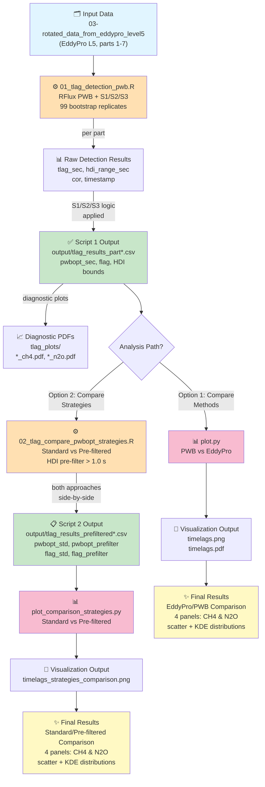
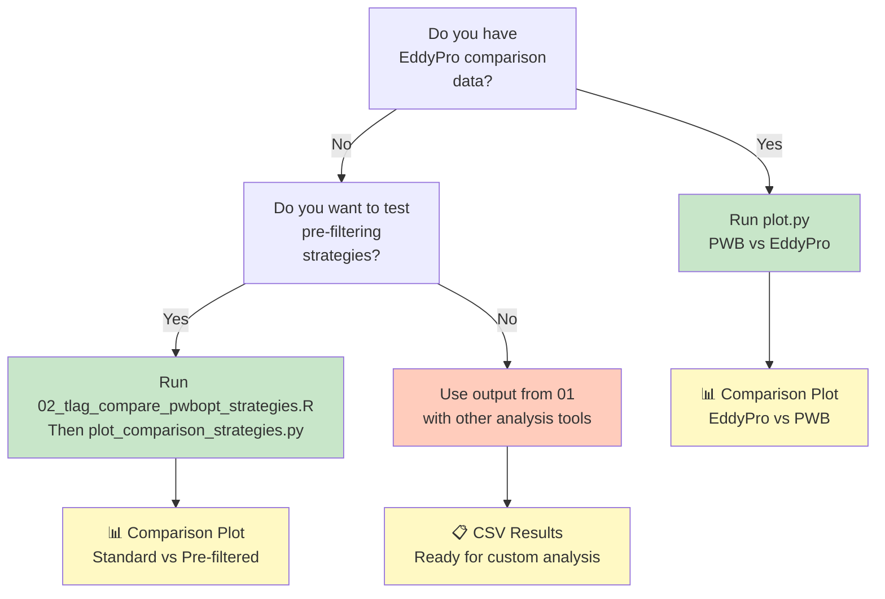
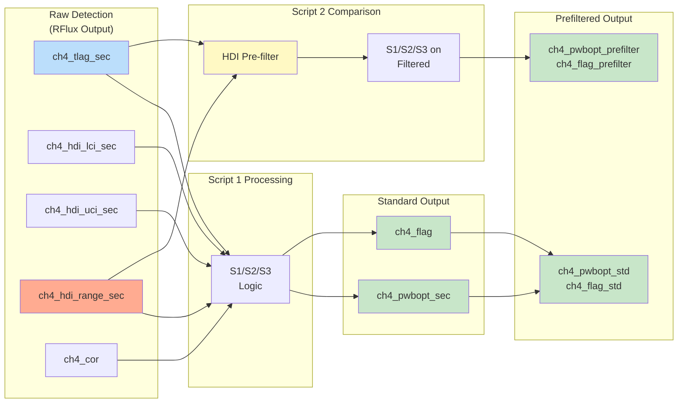

# Time Lag Detection Workflow

```mermaid
flowchart TD
    A["🗂️ Input Data<br/>03-rotated_data_from_eddypro_level5<br/>(EddyPro L5, parts 1-7)"] --> B["⚙️ 01_tlag_detection_pwb.R<br/>RFlux PWB + S1/S2/S3<br/>99 bootstrap replicates"]
    
    B -->|per part| C["📊 Raw Detection Results<br/>tlag_sec, hdi_range_sec<br/>cor, timestamp"]
    
    C -->|S1/S2/S3 logic<br/>applied| D["✅ Script 1 Output<br/>output/tlag_results_part*.csv<br/>pwbopt_sec, flag, HDI bounds"]
    
    D -->|diagnostic plots| E["📈 Diagnostic PDFs<br/>tlag_plots/<br/>*_ch4.pdf, *_n2o.pdf"]
    
    D --> F{Analysis Path?}
    
    F -->|Option 1: Compare<br/>Methods| G["📊 plot.py<br/>PWB vs EddyPro"]
    
    F -->|Option 2: Compare<br/>Strategies| H["⚙️ 02_tlag_compare_pwbopt_strategies.R<br/>Standard vs Pre-filtered<br/>HDI pre-filter > 1.0 s"]
    
    H -->|both approaches<br/>side-by-side| I["📋 Script 2 Output<br/>output/tlag_results_prefiltered*.csv<br/>pwbopt_std, pwbopt_prefilter<br/>flag_std, flag_prefilter"]
    
    I --> J["📊 plot_comparison_strategies.py<br/>Standard vs Pre-filtered"]
    
    G --> K["🎨 Visualization Output<br/>timelags.png<br/>timelags.pdf"]
    
    J --> L["🎨 Visualization Output<br/>timelags_strategies_comparison.png"]
    
    K --> M["✨ Final Results<br/>EddyPro/PWB Comparison<br/>4 panels: CH4 & N2O<br/>scatter + KDE distributions"]
    
    L --> N["✨ Final Results<br/>Standard/Pre-filtered Comparison<br/>4 panels: CH4 & N2O<br/>scatter + KDE distributions"]
    
    style A fill:#e1f5ff
    style D fill:#c8e6c9
    style I fill:#c8e6c9
    style M fill:#fff9c4
    style N fill:#fff9c4
    style B fill:#ffe0b2
    style H fill:#ffe0b2
    style G fill:#f8bbd0
    style J fill:#f8bbd0
```

## Processing Flow by Script

```mermaid
flowchart LR
    subgraph "Script 1: Detection"
        S1A["Load rotated data<br/>part N"] --> S1B["Run tlag_detection<br/>Rboot=99"]
        S1B --> S1C["Extract raw lag<br/>HDI bounds"]
        S1C --> S1D["Apply S1/S2/S3<br/>logic"]
        S1D --> S1E["Save to output/"]
        S1E --> S1F["Generate PDFs"]
    end
    
    subgraph "Script 2: Strategy Comparison"
        S2A["Read tlag_results_part*.csv"] --> S2B["Standard approach<br/>S1/S2/S3 on all"]
        S2A --> S2C["Pre-filter: HDI > 1.0s<br/>set to NA"]
        S2C --> S2D["Pre-filtered approach<br/>S1/S2/S3 on filtered"]
        S2B --> S2E["Compare both<br/>side-by-side"]
        S2D --> S2E
        S2E --> S2F["Save prefiltered CSVs<br/>Print summary stats"]
    end
    
    subgraph "Visualization"
        V1["Plot.py"] --> V1O["timelags.png/pdf<br/>PWB vs EddyPro"]
        V2["plot_comparison_strategies.py"] --> V2O["timelags_strategies_comparison.png<br/>Standard vs Pre-filtered"]
    end
    
    S1F -.->|tlag_results_part*.csv| S2A
    S1E -.->|tlag_results_part*.csv| V1
    S2F -.->|tlag_results_prefiltered*.csv| V2
    
    style S1A fill:#bbdefb
    style S1E fill:#c8e6c9
    style S2A fill:#bbdefb
    style S2F fill:#c8e6c9
    style V1O fill:#fff9c4
    style V2O fill:#fff9c4
```

## Decision Tree: Which Path to Take?

```mermaid
flowchart TD
    Q1["Do you have<br/>EddyPro comparison<br/>data?"]
    
    Q1 -->|Yes| A["Run plot.py<br/>PWB vs EddyPro"]
    Q1 -->|No| Q2["Do you want to test<br/>pre-filtering<br/>strategies?"]
    
    Q2 -->|Yes| B["Run 02_tlag_compare_pwbopt_strategies.R<br/>Then plot_comparison_strategies.py"]
    Q2 -->|No| C["Use output from 01<br/>with other analysis tools"]
    
    A --> O1["📊 Comparison Plot<br/>EddyPro vs PWB"]
    B --> O2["📊 Comparison Plot<br/>Standard vs Pre-filtered"]
    C --> O3["📋 CSV Results<br/>Ready for custom analysis"]
    
    style A fill:#c8e6c9
    style B fill:#c8e6c9
    style C fill:#ffccbc
    style O1 fill:#fff9c4
    style O2 fill:#fff9c4
    style O3 fill:#fff9c4
```

## Data Column Flow

```mermaid
flowchart LR
    subgraph "Raw Detection<br/>(RFlux Output)"
        R1["ch4_tlag_sec"]
        R2["ch4_hdi_lci_sec"]
        R3["ch4_hdi_uci_sec"]
        R4["ch4_hdi_range_sec"]
        R5["ch4_cor"]
    end
    
    subgraph "Script 1 Processing"
        P1["S1/S2/S3<br/>Logic"]
    end
    
    subgraph "Standard Output"
        O1["ch4_pwbopt_sec"]
        O2["ch4_flag"]
    end
    
    subgraph "Script 2 Comparison"
        C1["HDI Pre-filter"]
        C2["S1/S2/S3 on<br/>Filtered"]
    end
    
    subgraph "Prefiltered Output"
        PO1["ch4_pwbopt_std<br/>ch4_flag_std"]
        PO2["ch4_pwbopt_prefilter<br/>ch4_flag_prefilter"]
    end
    
    R1 --> P1
    R2 --> P1
    R3 --> P1
    R4 --> P1
    R5 --> P1
    
    P1 --> O1
    P1 --> O2
    
    R4 --> C1
    R1 --> C1
    C1 --> C2
    
    O1 --> PO1
    O2 --> PO1
    C2 --> PO2
    
    style R1 fill:#bbdefb
    style R4 fill:#ffab91
    style O1 fill:#c8e6c9
    style O2 fill:#c8e6c9
    style C1 fill:#fff9c4
    style PO1 fill:#c8e6c9
    style PO2 fill:#c8e6c9
```
